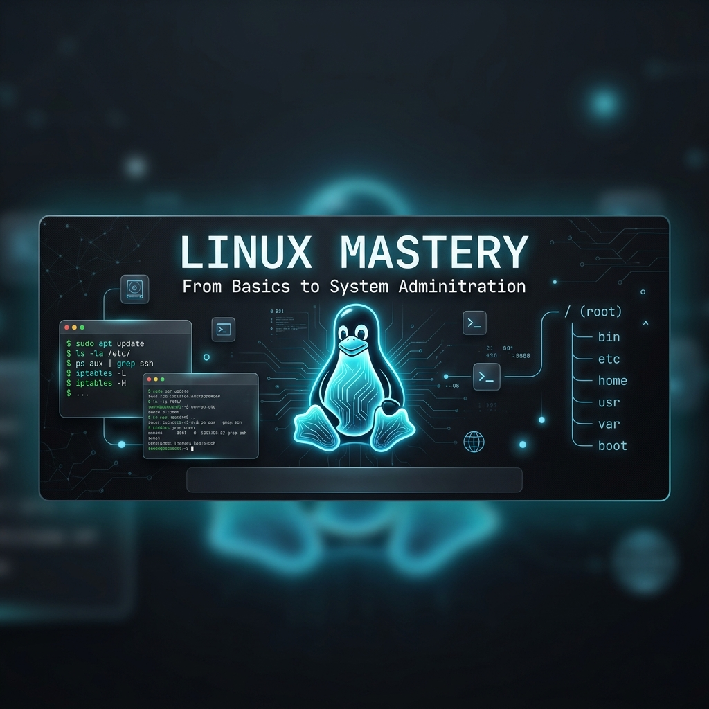

# Linux Mastery — From Basics to System Administration



Welcome to the **Linux Mastery Study Guide** — a comprehensive, hands-on reference for developers, system administrators, and power users. Inspired by real-world Linux usage and professional sysadmin best practices.

## Table of Contents

1. [Module 01: Introduction & Getting Started](#module-01)
    - [What is Linux?](#module-01-what)
    - [The Linux Architecture](#module-01-arch)
    - [Terminal Shortcuts & Basics](#module-01-shortcuts)
    - [Foundation Cementing: Your First Shell Session](#module-01-foundation)
2. [Module 02: File System & Management](#module-02)
    - [The Linux Directory Structure (FHS)](#module-02-fhs)
    - [Basic File Operations: ls, cd, pwd, mkdir](#module-02-ops)
    - [Moving, Copying & Removing: mv, cp, rm](#module-02-move)
    - [Foundation Cementing: Organizing Your Workspace](#module-02-foundation)
3. [Module 03: Text Processing & Filtering](#module-03)
    - [Viewing Files: cat, less, head, tail](#module-03-view)
    - [Searching & Filtering: grep](#module-03-grep)
    - [Stream Editing: sed & awk](#module-03-stream)
    - [Foundation Cementing: Log Analysis Basics](#module-03-foundation)
4. [Module 04: Users, Groups & Permissions](#module-04)
    - [Understanding Linux Permissions (rwx)](#module-04-perms)
    - [Changing Permissions: chmod & chown](#module-04-change)
    - [User & Group Management](#module-04-users)
    - [Foundation Cementing: Securing a Directory](#module-04-foundation)
5. [Module 05: Process Management](#module-05)
    - [Viewing Processes: ps, top, htop](#module-05-view)
    - [Controlling Processes: kill, nice, renice](#module-05-control)
    - [Job Control: bg, fg, jobs](#module-05-jobs)
    - [Foundation Cementing: Managing a Background Task](#module-05-foundation)
6. [Module 06: Networking & Remote Access](#module-06)
7. [Module 07: Shell Scripting Basics](#module-07)
8. [Module 08: Package Management](#module-08)
9. [Module 09: System Information & Monitoring](#module-09)
10. [Module 10: Archiving & Compression](#module-10)
11. [Module 11: Modifying Users](#module-11)
12. [Module 12: LAMP Stack](#module-12)
13. [Module 13: tee Command](#module-13)
14. [Module 14: Secure Shell (SSH)](#module-14)
15. [Module 15: SCP](#module-15)
16. [Module 16: GnuPG (GPG)](#module-16)
17. [Module 17: Network Configuration](#module-17)
18. [Appendix A: Top Linux Interview Q&A](#appendix-a)
19. [Appendix B: Linux Commands Cheatsheet](#appendix-b)

---

<a name="module-01"></a>
## Module 01 — Introduction & Getting Started
*Phase: Foundations*

Linux is a family of open-source Unix-like operating systems based on the Linux kernel, first released by Linus Torvalds in 1991.

> [!NOTE]
> **Design Philosophy**: In Linux, **everything is a file**. Your hard drive is a file, your keyboard is a file, and even running processes are represented as files in the `/proc` directory.

<a name="module-01-arch"></a>
### The Linux Architecture

The Linux system is composed of four main layers:
1. **Hardware**: The physical machine (CPU, RAM, Disk).
2. **Kernel**: The core of the OS that manages hardware and provides services to applications.
3. **Shell**: The interface that allows users to interact with the kernel (e.g., Bash, Zsh).
4. **Applications**: User-level programs (e.g., Firefox, VIM, GCC).

<a name="module-01-shortcuts"></a>
### Terminal Shortcuts & Basics

Mastering the terminal starts with knowing the shortcuts:

| Shortcut | Action |
| :--- | :--- |
| **Ctrl + C** | Interrupt/Stop the current process. |
| **Ctrl + Z** | Suspend/Pause the current process. |
| **Ctrl + D** | Exit the current shell (EOF). |
| **Ctrl + L** | Clear the terminal screen. |
| **Tab** | Auto-complete commands and file names. |
| **Ctrl + R** | Search through command history. |

<a name="module-01-foundation"></a>
### Foundation Cementing: Your First Shell Session

```bash
# Check your current user
whoami

# Check the system hostname
hostname

# See system information
uname -a

# Check the current date and time
date
```

---

<a name="module-02"></a>
## Module 02 — File System & Management
*Phase: Foundations*

<a name="module-02-fhs"></a>
### The Linux Directory Structure (FHS)

Linux follows the Filesystem Hierarchy Standard (FHS):

| Directory | Description |
| :--- | :--- |
| `/bin` | Essential user command binaries (e.g., ls, cp). |
| `/etc` | System-wide configuration files. |
| `/home` | User home directories. |
| `/root` | Home directory for the root user. |
| `/tmp` | Temporary files. |
| `/var` | Variable data files (e.g., logs, databases). |
| `/dev` | Device files. |

<a name="module-02-ops"></a>
### Basic File Operations: ls, cd, pwd, mkdir

```bash
# Print working directory
pwd

# List files (long format, include hidden)
ls -la

# Change directory
cd /etc

# Create a new directory
mkdir my_docs
```

<a name="module-02-move"></a>
### Moving, Copying & Removing: mv, cp, rm

```bash
# Copy a file
cp source.txt destination.txt

# Move or rename a file
mv old_name.txt new_name.txt

# Remove a file
rm file.txt

# Remove a directory and its contents (recursive)
rm -rf my_old_dir
```

> [!WARNING]
> **`rm -rf` is dangerous.** It deletes files permanently without asking for confirmation. Always double-check the path before running it.

---

<a name="module-03"></a>
## Module 03 — Text Processing & Filtering
*Phase: Data Handling*

Linux provides powerful tools for manipulating text, which is essential for configuration and log analysis.

<a name="module-03-view"></a>
### Viewing Files: cat, less, head, tail

```bash
# Concatenate and print a file
cat file.txt

# View a file one page at a time (scrollable)
less large_file.log

# View the first 10 lines
head -n 10 file.txt

# View the last 10 lines (follow changes in real-time)
tail -f access.log
```

<a name="module-03-grep"></a>
### Searching & Filtering: grep

`grep` searches for patterns within files.

```bash
# Search for "error" in a log file
grep "error" sys.log

# Case-insensitive search
grep -i "ERROR" sys.log

# Search recursively in a directory
grep -r "TODO" ./src
```

<a name="module-03-stream"></a>
### Stream Editing: sed & awk

```bash
# sed: Replace "apple" with "orange" in a file
sed -i 's/apple/orange/g' fruits.txt

# awk: Print the first column of a space-separated file
awk '{print $1}' data.txt
```

---

<a name="module-04"></a>
## Module 04 — Users, Groups & Permissions
*Phase: Security*

Linux is a multi-user system. Permissions control who can read, write, or execute files.

<a name="module-04-perms"></a>
### Understanding Linux Permissions (rwx)

Permissions are shown in `ls -l` as `rwxrwxrwx`:
- **Owner** (first 3)
- **Group** (middle 3)
- **Others** (last 3)

| Symbol | Value | Description |
| :---: | :---: | :--- |
| `r` | 4 | Read |
| `w` | 2 | Write |
| `x` | 1 | Execute |

<a name="module-04-change"></a>
### Changing Permissions: chmod & chown

```bash
# Give execute permission to owner
chmod u+x script.sh

# Set permissions to 755 (rwxr-xr-x)
chmod 755 script.sh

# Change owner of a file
sudo chown user:group file.txt
```

<a name="module-04-foundation"></a>
### Foundation Cementing: Securing a Directory

```bash
mkdir private_data
chmod 700 private_data # Only owner can access
ls -ld private_data
```

---

<a name="module-05"></a>
## Module 05 — Process Management
*Phase: System Control*

<a name="module-05-view"></a>
### Viewing Processes: ps, top, htop

```bash
# List all running processes
ps aux

# Real-time process monitoring
top

# Search for a specific process
ps aux | grep "nginx"
```

<a name="module-05-control"></a>
### Controlling Processes: kill, nice, renice

```bash
# Terminate a process by PID
kill 1234

# Force terminate (SIGKILL)
kill -9 1234

# Run a command with low priority
nice -n 10 ./my_script.sh
```

<a name="module-05-jobs"></a>
### Job Control: bg, fg, jobs

```bash
# Run a command in the background
./long_task.sh &

# List background jobs
jobs

# Bring a job to the foreground
fg %1
```

---

<a name="module-06"></a>
## Module 06 — Networking & Remote Access
*Phase: Connectivity*

Linux is the backbone of the internet. Understanding its networking tools is crucial.

<a name="module-06-tools"></a>
### Basic Networking Tools

```bash
# Check IP addresses and interfaces
ip addr show

# Test connectivity to a host
ping google.com

# Download a file from the web
wget https://example.com/file.zip
# OR
curl -O https://example.com/file.zip

# See active network connections
netstat -tuln
# OR (modern)
ss -tuln
```

<a name="module-06-ssh"></a>
### Remote Access: SSH & SCP

```bash
# Connect to a remote server
ssh user@remote_host

# Copy a file to a remote server
scp file.txt user@remote_host:/home/user/

# Copy a directory from a remote server
scp -r user@remote_host:/home/user/dir ./local_dir
```

---

<a name="module-07"></a>
## Module 07 — Shell Scripting Basics
*Phase: Automation*

Shell scripts allow you to automate repetitive tasks by combining Linux commands.

<a name="module-07-basics"></a>
### Script Anatomy: Shebang & Variables

```bash
#!/bin/bash
# This is a comment

NAME="Linux Learner"
echo "Hello, $NAME!"
```

<a name="module-07-logic"></a>
### Conditionals & Loops

```bash
# If statement
if [ -f "config.txt" ]; then
    echo "Config file exists."
else
    echo "Config file missing."
fi

# For loop
for i in {1..5}; do
    echo "Iteration $i"
done
```

---

<a name="module-08"></a>
## Module 08 — Package Management
*Phase: Software Management*

Different Linux distributions use different package managers to install and update software.

| Distribution | Package Manager | Common Commands |
| :--- | :--- | :--- |
| **Ubuntu/Debian** | `apt` | `sudo apt update`, `sudo apt install pkg` |
| **CentOS/RHEL** | `yum` / `dnf` | `sudo dnf install pkg` |
| **Arch Linux** | `pacman` | `sudo pacman -S pkg` |

```bash
# Update package lists
sudo apt update

# Install a package
sudo apt install htop

# Remove a package
sudo apt remove htop
```

---

<a name="module-09"></a>
## Module 09 — System Information & Monitoring
*Phase: System Health*

<a name="module-09-disk"></a>
### Disk Usage: df & du

```bash
# See free disk space (human-readable)
df -h

# See size of a directory
du -sh /var/log
```

<a name="module-09-memory"></a>
### Memory & Uptime

```bash
# See free and used memory
free -h

# See how long the system has been running
uptime
```

---

<a name="module-10"></a>
## Module 10 — Archiving & Compression
*Phase: Data Management*

<a name="module-10-tar"></a>
### The tar Command

`tar` (Tape Archive) is the standard tool for grouping files.

```bash
# Create a compressed archive (tar.gz)
tar -czvf archive.tar.gz /path/to/dir

# Extract an archive
tar -xzvf archive.tar.gz

# List contents of an archive
tar -tzvf archive.tar.gz
```

| Flag | Description |
| :---: | :--- |
| `-c` | Create |
| `-x` | Extract |
| `-z` | Gzip compression |
| `-v` | Verbose (show progress) |
| `-f` | File (specify filename) |

---

<a name="module-11"></a>
## Module 11 - Modifying Users
*Phase: Access Control*

Linux is multi-user by design, so user and group administration is core sysadmin knowledge.

<a name="module-11-passwords"></a>
### Password Management

```bash
# Change your own password
passwd

# Change another user's password (requires sudo)
sudo passwd alice
```

<a name="module-11-user-mgmt"></a>
### Add and Remove Users

```bash
# Add a new user with home directory
sudo useradd -m alice

# Add user with interactive prompt (Debian/Ubuntu friendly)
sudo adduser bob

# Remove user (keep home directory)
sudo userdel bob

# Remove user and home directory
sudo userdel -r bob
```

<a name="module-11-groups"></a>
### Group Membership

```bash
# Show groups for current user
groups

# Show groups for another user
groups alice

# Add user to a group
sudo usermod -aG sudo alice
```

---

<a name="module-12"></a>
## Module 12 - LAMP Stack
*Phase: Web Stack*

LAMP stands for Linux, Apache, MySQL/MariaDB, and PHP - a classic web application stack.

<a name="module-12-ubuntu"></a>
### Install LAMP on Ubuntu/Debian

```bash
sudo apt update
sudo apt install -y apache2 mysql-server php libapache2-mod-php php-mysql

# Start and enable services
sudo systemctl enable --now apache2
sudo systemctl enable --now mysql
```

<a name="module-12-arch"></a>
### Install LAMP on Arch Linux

```bash
sudo pacman -Syu apache mariadb php php-apache
sudo systemctl enable --now httpd
sudo systemctl enable --now mariadb
```

<a name="module-12-rhel"></a>
### Install LAMP on CentOS/RHEL

```bash
sudo dnf install -y httpd mariadb-server php php-mysqlnd
sudo systemctl enable --now httpd
sudo systemctl enable --now mariadb
```

---

<a name="module-13"></a>
## Module 13 - tee Command
*Phase: Stream Control*

`tee` copies stdin to stdout and one or more files, making it ideal for logging command output while still seeing it live.

<a name="module-13-basic"></a>
### Basic tee Usage

```bash
# Save command output to file while printing to terminal
ls -la | tee file-list.txt

# Append instead of overwrite
date | tee -a run.log
```

<a name="module-13-pipes"></a>
### Use tee in Pipe Chains

```bash
# Capture intermediate output in a pipeline
cat access.log | grep "ERROR" | tee errors.log | wc -l

# Write to multiple files
echo "deployment done" | tee deploy.log deploy.backup.log
```

---

<a name="module-14"></a>
## Module 14 - Secure Shell (SSH)
*Phase: Remote Administration*

SSH provides encrypted remote shell access and secure administration for servers.

<a name="module-14-connect"></a>
### Connect and Install OpenSSH

```bash
# Connect to remote host
ssh user@server.example.com

# Ubuntu/Debian install
sudo apt install -y openssh-client openssh-server

# Arch install
sudo pacman -S openssh
```

<a name="module-14-keys"></a>
### Passwordless Login with Key Pairs

```bash
# Generate key pair
ssh-keygen -t ed25519 -C "you@example.com"

# Copy public key to server
ssh-copy-id user@server.example.com

# Login without password prompt
ssh user@server.example.com
```

<a name="module-14-server"></a>
### SSH Server Basics

```bash
# Start and enable SSH daemon
sudo systemctl enable --now ssh

# Check service status (name may be ssh or sshd by distro)
sudo systemctl status ssh
sudo systemctl status sshd
```

---

<a name="module-15"></a>
## Module 15 - SCP
*Phase: Secure File Transfer*

SCP uses SSH transport to copy files and directories securely between systems.

<a name="module-15-basic"></a>
### Basic SCP Transfers

```bash
# Copy local file to remote host
scp report.txt user@server.example.com:/home/user/

# Copy remote file to local machine
scp user@server.example.com:/var/log/syslog ./syslog.copy
```

<a name="module-15-recursive"></a>
### Recursive Copy and Port Selection

```bash
# Copy local directory recursively
scp -r ./project user@server.example.com:/home/user/

# Use custom SSH port
scp -P 2222 backup.tar.gz user@server.example.com:/tmp/
```

---

<a name="module-16"></a>
## Module 16 - GnuPG (GPG)
*Phase: Encryption & Signing*

GPG is used to encrypt data and sign files/messages to provide confidentiality and authenticity.

<a name="module-16-keys"></a>
### Create and Export Keys

```bash
# Generate a key pair
gpg --full-generate-key

# List keys
gpg --list-keys

# Export public key
gpg --armor --export you@example.com > publickey.asc
```

<a name="module-16-encrypt"></a>
### Encrypt, Decrypt, Sign, Verify

```bash
# Encrypt file for recipient
gpg --encrypt --recipient friend@example.com secrets.txt

# Decrypt file
gpg --decrypt secrets.txt.gpg > secrets.txt

# Sign file
gpg --armor --output notes.sig --detach-sign notes.txt

# Verify signature
gpg --verify notes.sig notes.txt
```

---

<a name="module-17"></a>
## Module 17 - Network Configuration
*Phase: Connectivity Engineering*

Linux networking tasks include DNS resolution, routes, interface inspection, and manual IP assignment.

<a name="module-17-dns"></a>
### DNS and Hostname Resolution

```bash
# See configured resolver
cat /etc/resolv.conf

# Add static hostname mapping
echo "192.168.1.50 myapp.local" | sudo tee -a /etc/hosts
```

<a name="module-17-routes"></a>
### View and Manage Routes

```bash
# View routing table
ip route show

# Add default route
sudo ip route add default via 192.168.1.1 dev eth0
```

<a name="module-17-iface"></a>
### Interface Details and IP Assignment

```bash
# Show interfaces and addresses
ip addr show

# Add IP address to interface
sudo ip addr add 192.168.1.100/24 dev eth0

# Bring interface up
sudo ip link set eth0 up
```

---

<a name="appendix-a"></a>
## Appendix A - Top Linux Interview Q&A

**Q1. What is the difference between a process and a thread?**
- A process is an independent running program with its own memory space.
- A thread is a lightweight execution unit inside a process that shares memory with sibling threads.

**Q2. What is the difference between hard link and symbolic link?**
- Hard link points to the same inode as the original file.
- Symbolic link is a separate file that points to another path.

**Q3. What does `chmod 755` mean?**
- Owner: `rwx` (7), Group: `r-x` (5), Others: `r-x` (5).

**Q4. How do you check open ports on Linux?**
- Use `ss -tuln` (modern) or `netstat -tuln` (legacy).

**Q5. What does `sudo` do?**
- Runs a command with elevated privileges according to `/etc/sudoers` policy.

---

<a name="appendix-b"></a>
## Appendix B - Linux Commands Cheatsheet

| Category | Command | Description |
| :--- | :--- | :--- |
| **Navigation** | `pwd` | Print current directory |
| | `cd <dir>` | Change directory |
| | `ls -la` | List files in long format with hidden files |
| **Files** | `cp src dst` | Copy file |
| | `mv old new` | Move/rename file |
| | `rm -rf dir` | Remove directory recursively |
| **Text** | `grep "x" file` | Search pattern in file |
| | `sed 's/a/b/g' file` | Stream edit replacement |
| | `awk '{print $1}' file` | Print first column |
| **Processes** | `ps aux` | List all processes |
| | `top` | Real-time process monitor |
| | `kill -9 <pid>` | Force kill process |
| **Network** | `ip addr` | Show interfaces and IPs |
| | `ss -tuln` | Show listening sockets |
| | `ping host` | Check host reachability |
| **Remote** | `ssh user@host` | Remote shell login |
| | `scp file user@host:/path` | Secure file copy |
| **Archives** | `tar -czvf a.tar.gz dir` | Create compressed archive |
| | `tar -xzvf a.tar.gz` | Extract compressed archive |
